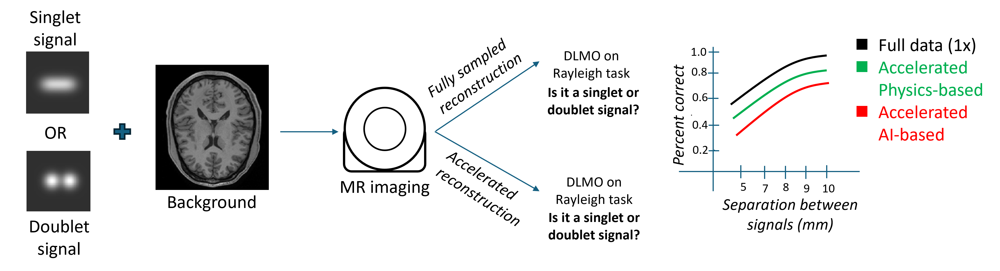

# Evaluating the resolution of AI-based accelerated MR reconstruction using a deep learning-based model observer (DLMO)
**The DLMO framework** evaluates multi-coil sensitivity encoding parallel MR imaging systems at different acceleration factors on the Rayleigh discrimination task as a surrogate measure of resolution, as detailed in our paper. You can implement the DLMO framework with other vendor-specific image acquisition settings and reconstruction methods to demonstrate their diagnostic efficacy.



## Requirements

Create a new conda enviroment and install the required packages as follows:
```
$ conda create --name dlmo --file requirements.txt
$ conda activate dlmo
```

## Usage
The example codes below show how to run the DLMO framework. To run the code, please accordingly change input paths and relevant parameters for your application.

* [**A simple example of the DLMO framework**](https://github.com/DIDSR/DLMO/tree/main/src/demo1)

    This example includes four parts: 1) Synthetic data generation, 2) AI reconstruction, 3) DLMO training, and 4) DLMO testing. Please follow the order to run this example.

    1. [*Synthetic data generation*](https://github.com/DIDSR/DLMO/tree/main/src/demo1/synthetic_data_generation)

    This script performs forward projection and reconstruction of DDPM (Denoising Diffusion Probabilistic Models) generated objects using RSOS (Root Sum of Squares) method to create a few examples of accelerated MR images. It saves the reconstructions in HDF5 format as well as png format.

    2. [*AI reconstruction*](https://github.com/DIDSR/DLMO/tree/main/src/demo1/AI_rec)

    Demo scripts for AI-based reconstruction methods. A U-Net example is included. The test data and its predictions are large files so does not provided here. To obtain those, please generate them using scripts in synthetic_data_generation folder.

    3. [*DLMO training*](https://github.com/DIDSR/DLMO/tree/main/src/demo1/DLMO_training)

    Train the deep learning-based model observer. It supports distributed training using Horovod and handles various configurations through command-line arguments.

    4. [*DLMO testing*](https://github.com/DIDSR/DLMO/tree/main/src/demo1/DLMO_test)

    This example estimates the probability of doublet signal using a trained deep learning-based model observer. It supports the Rayleigh discrimination tasks, and can handle both regular and CNN-denoised images. The script uses Horovod for distributed training and PyTorch for the neural network implementation.

* [**Object generation using DDPM**](https://github.com/DIDSR/DLMO/tree/main/src/demo2)

    This example generates a large batch of image samples from a model and save them as a large numpy array. This can be used to produce samples for FID evaluation.


* [**MR acquisition and reconstruction**](https://github.com/DIDSR/DLMO/tree/main/src/demo3)

    This example shows forward projection and reconstruction of DDPM generated objects using the rSOS method to create test dataset. It saves the reconstructions in HDF5 format.


* [**Syntheric defect insertion**](https://github.com/DIDSR/DLMO/tree/main/src/demo4)

    This script inserts doulet and singlet signals into DDPM generated objects. It saves the objects with signals in HDF5 format.


* [**Statistical anslysis**](https://github.com/DIDSR/DLMO/tree/main/src/demo5)

    Statistical analysis includes two example scripts: 1) sample size determination via a power analysis and 2) statistical analysis for a pivotal study. Pre-installation of the iMRMC application is **NOT** recommended for the use of these scripts.

1. [*Sample size determination*](https://github.com/DIDSR/DLMO/tree/main/src/demo5/power_analysis)

   This script conducts a power analysis for sample size determination in our paper. To run the script, simply execute `power_analysis_BDG.R`. To use your own pilot data, please replace `pliot_data.csv` with your data following the same format, and update proportion correct by DLMO and its variance in the `power_analysis_BDG.R`.

2. [*Pivotal study*](https://github.com/DIDSR/DLMO/tree/main/src/demo5/pivotal_study)

    This script conducts a similarity test to investigate whether DLMO performs similarly to human readers within a pre-defined margin of 0.1 proportion correct. To run the script, simply execute `similarity_test.R`. To use it for your own project, please update the `DLMO reading results` section in `similarity_test.R`, and provide reading scores in the `reading_scores` folder following the same format.


## License and Copyright
DLMO is distributed under the MIT license. See [LICENSE](https://github.com/DIDSR/DLMO/tree/main/LICENSE) for more information.

## Citation

## Disclaimer
