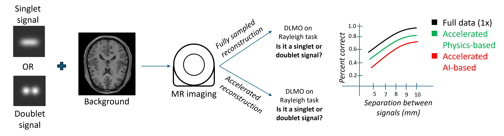

# Evaluating the resolution of AI-based accelerated MR reconstruction using a DLMO
This **DLMO (Deep Learning Model Observer)** implementation evaluates multi-coil sensitivity encoding parallel MR imaging systems at different acceleration factors on the Rayleigh discrimination task as a surrogate measure of resolution, as detailed in [our DLMO paper](https://arxiv.org/abs/2602.22535). You can implement the DLMO approach with other image acquisition settings and reconstruction methods to demonstrate their diagnostic efficacy.



## Requirements

Create a new conda enviroment and install the required packages as follows:
```
$ GIT_LFS_SKIP_SMUDGE=1 git clone https://github.com/DIDSR/DLMO.git #to avoid LFS quota issue
$ conda create --name dlmo --file requirements.txt
$ conda activate dlmo
```

## Usage
The example codes below demonstrate how to run the DLMO. Before running the code, update the input paths and adjust the relevant parameters according to your specific application.

Please refer to the hyperlinks for detailed usage of each demo. 

1. [**Object generation using DDPM**](https://github.com/DIDSR/DLMO/tree/main/src/demo1)

    This demo allows one to generate a large batch of image samples using a trained DDPM[^refDDPM] model that are saved as a numpy array. These sample images are employed as to-be-imaged patient (backgrounds) in this DLMO approach.

2. [**Synthetic defect insertion**](https://github.com/DIDSR/DLMO/tree/main/src/demo2)

    This script inserts doublet and singlet signals into DDPM generated objects. It saves the objects with signals in HDF5 format.

3. [**MR acquisition and reconstruction**](https://github.com/DIDSR/DLMO/tree/main/src/demo3)

    This example shows forward projection and reconstruction of DDPM generated objects using the rSOS method to create test dataset. It saves the reconstructions in HDF5 format.


4. [**A simple example of the DLMO approach**](https://github.com/DIDSR/DLMO/tree/main/src/demo4)

    This example includes four parts: 1) Image acquisition and reconstruction, 2) AI reconstruction, 3) DLMO training, and 4) DLMO testing. Please follow the order to run this example.

    1. [*Image acquisition and reconstruction*](https://github.com/DIDSR/DLMO/tree/main/src/demo4/image_acquisition_and_reconstruction)

    This script performs forward projection and reconstruction of DDPM (Denoising Diffusion Probabilistic Models) generated objects using RSOS (Root Sum of Squares) method to create a few examples of accelerated MR images. It saves the reconstructions in HDF5 format as well as png format.

    2. [*AI reconstruction*](https://github.com/DIDSR/DLMO/tree/main/src/demo4/AI_rec)

    Demo scripts for AI-based reconstruction methods. A U-Net example is included. The test data and its predictions are large files so does not provided here. To obtain those, please generate them using scripts in synthetic_data_generation folder.

    3. [*DLMO training*](https://github.com/DIDSR/DLMO/tree/main/src/demo4/DLMO_training)

    Train the deep learning-based model observer. It supports distributed training using Horovod and handles various configurations through command-line arguments.

    4. [*DLMO testing*](https://github.com/DIDSR/DLMO/tree/main/src/demo4/DLMO_test)

    This example estimates the probability of doublet signal using a trained deep learning-based model observer. It supports the Rayleigh discrimination tasks, and can handle both regular and CNN-denoised images. The script uses Horovod for distributed training and PyTorch for the neural network implementation.

5. [**Statistical analysis**](https://github.com/DIDSR/DLMO/tree/main/src/demo5)

    Statistical analysis includes two example scripts: 1) sample size determination via a power analysis and 2) statistical analysis for a pivotal study. Pre-installation of the iMRMC application is **NOT** recommended for the use of these scripts.

	1. [*Sample size determination*](https://github.com/DIDSR/DLMO/tree/main/src/demo5/power_analysis)

	This script conducts a power analysis for sample size determination in our paper. To run the script, simply execute `power_analysis_BDG.R`. To use your own pilot data, please replace `pliot_data.csv` with your data following the same format, and update proportion correct by DLMO and its variance in the `power_analysis_BDG.R`.

	2. [*Pivotal study*](https://github.com/DIDSR/DLMO/tree/main/src/demo5/pivotal_study)

    This script conducts a similarity test to investigate whether DLMO performs similarly to human readers within a pre-defined margin of 0.1 proportion correct. To run the script, simply execute `similarity_test.R`. To use it for your own project, please update the `DLMO reading results` section in `similarity_test.R`, and provide reading scores in the `reading_scores` folder following the same format.


## License and Copyright
DLMO is distributed under the MIT license. See [LICENSE](https://github.com/DIDSR/DLMO/tree/main/LICENSE) for more information.

## Citation
If you use the DLMO data or code in your project, please cite its [arXiv paper](https://arxiv.org/abs/2602.22535):
```
@article{yu2026evaluating,
    title={Evaluating the resolution of AI-based accelerated MR reconstruction using a deep learning-based model observer},
    author={Yu, Zitong and Zeng, Rongping and Samuelson, Frank and Kc, Prabhat},
    journal={arXiv preprint arXiv:2602.22535},
    year={2026}
}
```

## Disclaimer

## References
[^refDDPM]: J. Ho, A. Jain, and P. Abbeel, “Denoising diffusion probabilistic models,” Advances in neural information processing systems, vol. 33, pp. 6840–6851, 2020.
<!--
1. "HCP-Young Adult 2025,” https://www.humanconnectome.org/study/hcp-young-adult/document/hcp-young-adult-2025-release, 2025.
2. K. Li, H. Li, K. J. Myers, and M. A. Anastasio, “Estimating task-based performance bounds for accelerated MRI image reconstruction methods by use of learned-ideal observers,” in Medical Imaging 2025: Image Perception, Observer Performance, and Technology Assessment, vol. 13409. SPIE, 2025, pp. 125–129.
3. 
4. J. I. Tamir, F. Ong, J. Y. Cheng, M. Uecker, and M. Lustig, “Generalized magnetic resonance image reconstruction using the Berkeley advanced reconstruction toolbox,” in ISMRM Workshop on Data Sampling & Image Reconstruction, Sedona, AZ, vol. 7, 2016, p. 8.
5. FDA/CDRH, “iMRMC: Software for the Statistical Analysis of multi-reader multi-case studies,” RST Catalog, 2022, https://doi.org/10.5281/ZENODO.6628838.
-->