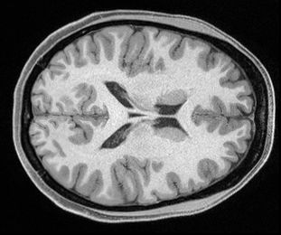

# Object generation using DDPM

The code below generates a large batch of image samples using a trained DDPM model saved a numpy array. 

Usage:

```
cd src/demo1
#PY_FILE=${PWD}/scripts/image_sample_newdataset2_centercrop.py
#MODEL_PATH=${PWD}/trained_DDPM_model/ema_0.9999_1100000.pt
PY_FILE=/projects01/didsr-aiml/prabhat.kc/code/mri_ddpm/HCP_diffusion_codes/scripts/image_sample_newdataset2_centercrop.py
MODEL_PATH=/projects01/didsr-aiml/prabhat.kc/code/mri_ddpm/HCP_diffusion_codes/trained_models/ema_0.9999_1100000.pt
OUTPUT_FLD="test_out_100k"

#CMD_ARGUMENTS
MODEL_FLAGS="--image_size 384 --attention_resolutions 32,16,8 --num_channels 128 --num_head_channels 64 --num_res_blocks 2 --resblock_updown True --use_scale_shift_norm True --learn_sigma True"
DIFFUSION_FLAGS="--diffusion_steps 10 --noise_schedule cosine "
sample_FLAGS="--save_dir ${OUTPUT_FLD}/HCP_brain_384x384_cropped_260x311_step1100k_ema_samples/ --num_samples 1 --batch_size 1"

time python ${PY_FILE} --model_path ${MODEL_PATH} $MODEL_FLAGS $DIFFUSION_FLAGS $sample_FLAGS 

```

Output files are in `${OUTPUT_FLD}` folder as `.npz` files.

An example of the outputs:

