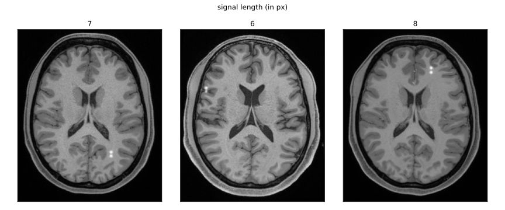
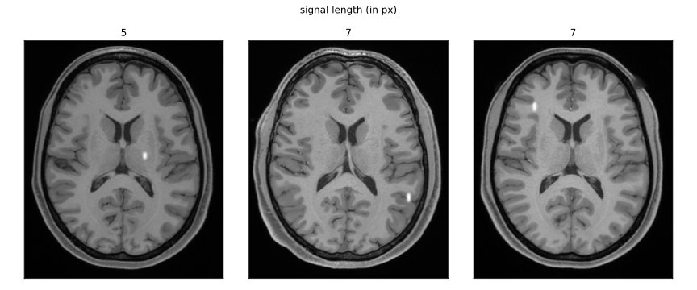
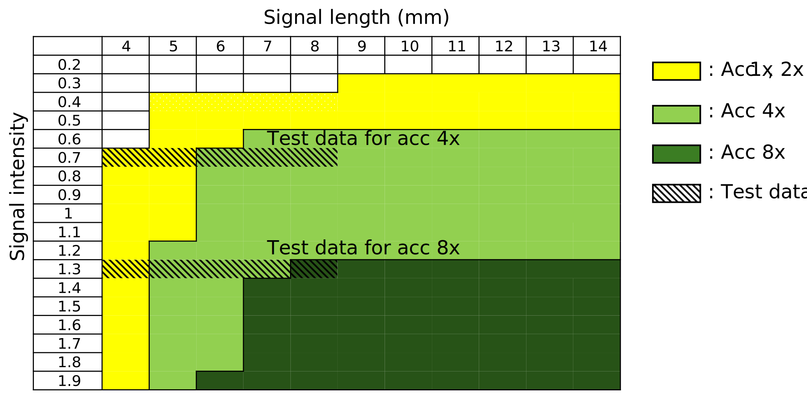

# Synthetic defect insertion

This script inserts doublet and singlet signals into DDPM generated MR images from demo 1. The singlet versus doublet signals for different signal lengths are determined using the 2AFC-based detection table provided below. This, in turn, means that singlet and doublet signals are set based on the acceleration factor, signal contrast, and signal length (in pixels). This code saves the objects with signals in HDF5 format.

Command-line input options:

	Acceleration (int):           Acceleration factor for sparse sampling (2, 4, 6, or 8).
	Amplitude (float):            Contrast value relevant to the acceleration factor.
	Signal lengths (str):         Comma-separated signal separation lengths, e.g. "4,5,6,7,8".
	Object NPZ path (optional):   Path to the DDPM-generated `.npz` file from demo 1.

Output
	The output HDF5 files are saved to `./objects/`. Each file contains datasets `H_0` (singlet reconstructions), `H_1` (doublet reconstructions), and `L_list` (signal lengths).

Usage:

```
python signal_insertion_test.py [acceleration factor] [contrast] [signal_lengths] [object_npz_path]
```

Examples:
    Run with acceleration factor 4 corresponding to the 7th row in the 2-AFC table below (also employed for testing in our DLMO paper):

```
python signal_insertion_test.py 4 0.7 '4,5,6,7,8'
```

A couple of MR images with the doublet signal corresponding to the demo run.

<p align="left">
	 
</p>

A couple of MR images with the siglet signal corresponding to the demo run.

<p align="left">
	 
</p>

Performance of the trained non-physician reader across a series of 2AFC studies. Each cell corresponds to one 2AFC study defined by a specific combination of signal intensity and signal length. Colored cells indicate conditions under which the reader achieved 100\% accuracy on the Rayleigh discrimination task. Note that whenever 100\% accuracy was achieved at a higher acceleration factor, the same signal condition also yielded 100\% accuracy at lower acceleration factors. For example, a signal with intensity 1.3 and length 8 mm resulted in perfect accuracy at acceleration factors of $8 \times$, then the same 100\% accuracy  is expected at $1 \times$, and $4 \times$ accelerations. Also, for a given signal intensity, note that whenever $100\%$ accuracy was achieved at a particular signal length, all longer signal lengths yielded $100\%$ accuracy as well. For example, for the acceleration factor $1\times$, $100\%$ accuracy was observed for a signal intensity of $1.3$ at a length of $4$ mm. The same held true for all lengths greater than $4$ mm at the same $1.3$ intensity for $1\times$.

<p align="left">
	 
</p>