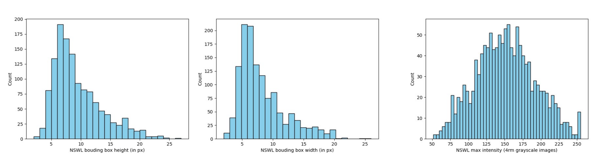

# Synthetic defect insertion

This script inserts doublet (or two dots) and singlet (or single dot) signals into DDPM-generated MR images from Demo 1. The singlet and doublet signals for different signal lengths are determined using the 2AFC-based discrimination table provided below. Consequently, the signals are defined by acceleration factor, signal contrast, and signal length (in pixels). The resulting images with inserted signals are saved in HDF5 format.

Command-line input options:

      acceleration (int)              : Acceleration factor for sparse sampling (2, 4, 6, or 8).
      contrast (float)                : Signal amplitude/contrast value.
      signal_lengths (str)            : Comma-separated signal separation lengths, e.g. "4,5,6,7,8".
      object_hdf5_path (str, optional): Path to the DDPM-generated objects from demo 1.

Usage:

```
python signal_insertion_test.py [acceleration factor] [contrast] [signal_lengths] [object_npz_path]
```

Examples: A demo run with the acceleration factor set to 4 and the signal length and intensity values corresponding to the 7th row of the 2-AFC table below (this row-based signal lengths and intensity values are also used for testing in our DLMO paper)

```
python signal_insertion_test.py 4 0.7 '4,5,6,7,8'
```

Output: Each output HDF5 file contains the following datasets: `H_s` (singlet images), `H_d` (doublet images), and `L_list` (signal lengths).

A couple of MR images with the doublet signal corresponding to the demo run.

<p align="left">
	 
</p>

A couple of MR images with the siglet signal corresponding to the demo run.

<p align="left">
	 
</p>

Note that the limiting conditions for different acceleration factor using iFFT-based reconstruction was determined across a series of 2AFC studies performed by a trained non-physician reader as shown below. Each cell corresponds to one 2AFC study defined by a specific combination of signal intensity and signal length. Colored cells indicate conditions under which the reader achieved 100% accuracy on the Rayleigh discrimination task. Note that whenever 100% accuracy was achieved at a higher acceleration factor, the same signal condition also yielded 100% accuracy at lower acceleration factors. For example, a signal with intensity 1.3 and length 8 mm resulted in perfect accuracy at acceleration factors of $8\times$, then the same condition is expected to yield 100% accuracy is expected at $1\times$, and $4\times$ accelerations. Also, for a given signal intensity, note that whenever 100% accuracy was achieved at a particular signal length, all longer signal lengths yielded 100% accuracy as well. For example, for the acceleration factor $1\times$, 100% accuracy was observed for a signal intensity of $1.3$ at a length of $4$ mm. The same held true for all lengths greater than $4$ mm at the same $1.3$ intensity for $1\times$. Here 1px = 1mm.

<p align="left">
	 
</p>

The shaded box indicates combinations of intensity and signal length used to generate testing images that encompass limiting conditions (for acceleration factors 4 and 8), to evaluate whether AI-based reconstruction provides better discriminatory capability than conventional iFFT-based reconstruction.

The relevance of this 2AFC study can also be inferred from its close alignment with the smallest signal length (~4 mm) and the lowest signal intensity (~0.3), which are similar to those observed in non-specific white lesion (NSWL) distributions from the fastMRI+ dataset. For this analysis, we predominantly included NSWLs with height and width < 20 px  from the  fastMRI+ dataset.

<p align="left">
	 
</p>

From these plots, we observe that NSWLs can be as small as 4–5 px in both width and height, with lower-end intensity values ranging from approximately 50/256 to 75/256. These limiting sizes and intensity values are similar to those obtained in our 2AFC study when MR acquisition is performed at a fully sampled rate.

We want our imaging system and its reconstruction method to perform as well as possible under limiting conditions—i.e., to enable detection and discrimination of the most challenging combinations of signal length and signal intensity. Accordingly, we assess whether discriminatory performance using AI-based reconstruction at an acceleration factor of 4 matches that of iFFT-based reconstruction at an acceleration factor of 1. Similar comparisons are made across other acceleration factors.

These comparisons are first performed along the boundary for a given acceleration factor (i.e., at 0.7 when comparing $4\times$ with $1\times$, and at 1.3 when comparing $8\times$ with $1\times$, corresponding to the shaded boxes in the above listed 2AFC table). If the accelerated reconstruction yields performance comparable to the fully sampled case, the signal intensity is then sequentially decreased (e.g., to 0.6 for the $4\times$ vs. $1\times$ comparison).
