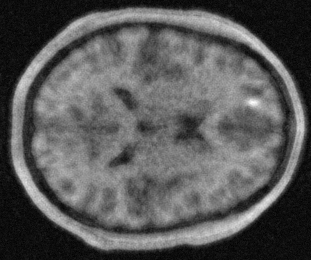
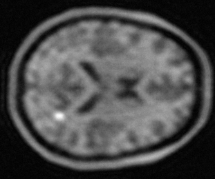

# MR acquisition and reconstruction

This example shows forward projection and reconstruction of DDPM generated objects using the rSOS method to create test dataset. It saves the reconstructions in HDF5 format.

Command-line Options:

```
Acceleration (int): Acceleration factor for sparse sampling (2, 4, 6, or 8).
```

Usage:

```
python rsos_ddpm_test.py [acceleration factor]
```

Examples:
	Run with acceleration factor 4:

```
python rsos_ddpm_test.py 4
```

Iutput files are `.npz` files generated in the demo1. The reconstructions are saved in HDF5 format in the `./rsos_rec/` folder. Each HDF5 file contains a dataset named `H_0` which holds the singlet image reconstructions, `H_1` for doublet image reconstructions, and `L_list` for the signal length for each reconstruction.

Examples of the reconstructions are shown below. The left one is for acceleration factor 4, which contains a singlet signal, and the right one is for acceleration factor 8, which contains a doublet signal. The signal length is 3 for both cases. The reconstructions are noisy, and the doublet signal is not visually distinguishable from the singlet signal, which makes it a challenging task.

