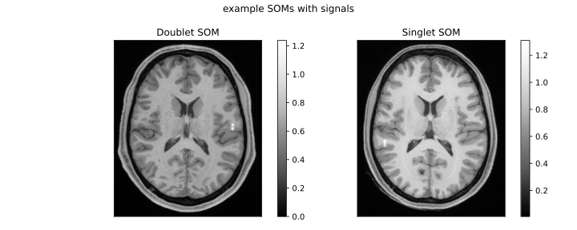
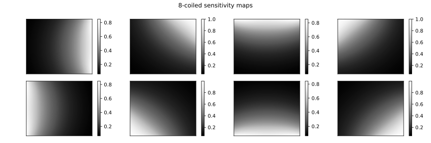
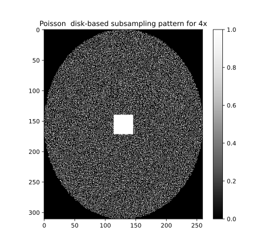
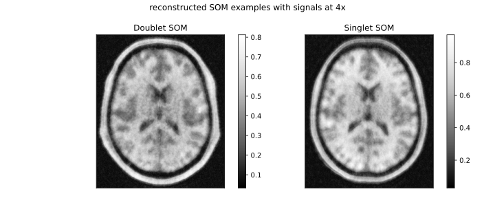
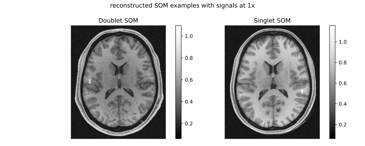

# MR acquisition and reconstruction

This example shows forward projection and reconstruction of DDPM-generated objects (SOMs) using the rSOS method to create a test dataset. It saves the reconstructions in HDF5 format.

Command-line Options:

```
acceleration_factor (int)       : Acceleration factor for sparse sampling (2, 4, 6, or 8).
object_hdf5_path (str, optional): Path to the DDPM-generated SOMs with added signals from demo 2.
```

Usage:

```
python rsos_ddpm_test.py [acceleration_factor] [object_hdf5_path]
```

Examples:
	Run with acceleration factor 4:

```
python rsos_ddpm_test.py 4
```

Input files are .hdf5 files obtained from Demo 2. The reconstructed images are saved in HDF5 format
in the ./rsos_rec/ folder. Each HDF5 file contains the following datasets: H_s for singlet image
reconstructions, H_d for doublet image reconstructions, and L_list for the signal lengths
corresponding to each reconstructed image.

A couple of MR SOMs with the doublet signal as inputs,`f(r)`, to this code.

<p align="left">
	 
</p>

The FFT data collected at each coil is modeled as

`g_i = \Phi \mathcal{F} S_i f(r) + n_i,`

where `n_i` denotes zero-mean Gaussian noise at each coil with a standard deviation set as 15.
Our forward model uses 8 coils (`S_i`) and a Poisson disk–based subsampling pattern (`\Phi`), as shown below:

<p align="left">
	 
</p>

<p align="left">
	 
</p>

Then reconstruction at each coil is combined using iFFT in the follow mannder:

`\hat{f}_i = \mathcal{F}^{-1} g_i`
`\hat{f}_{\text{rSOS}} = \sqrt{\sum_{i=1}^{N_c}|\hat{f}_i|^2}`

Both the accelerated and fully sampled rSOS reconstructions are saved in the final HDF5 files
using this script.

<p align="left">
	 
</p>

<p align="left">
	 
</p>
