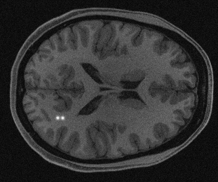

# Synthetic data generation

This script performs forward projection and reconstruction of DDPM (Denoising Diffusion Probabilistic Models) generated objects using RSOS (Root Sum of Squares) method to create a few examples of accelerated MR images. It saves the reconstructions in HDF5 format as well as png format.

Command-line Options:
```
Acceleration (int): Acceleration factor for sparse sampling (2, 4, 6, or 8).
```

Usage:
```
python synthetic_img_generation.py [acceleration factor]
```

Example of running the script at acceleration factor 2:
```
python synthetic_img_generation.py 2
```

Note: Ensure that all required data files and directories are properly set up before running the script.

Example of the outputs:




