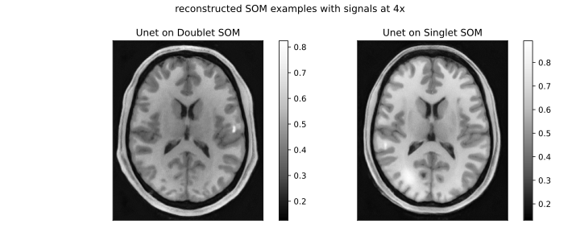

# AI reconstruction

Demo scripts for AI-based reconstruction methods are provided, including a U-Net example. Note that, in many of these demo runs, we use only 80 SOMs instead of the 8,000 used in our DLMO paper.

Usage:
```
python DL_denoiser_eval.py [-h] [--test-path TEST_PATH] [--task TASK]
                           [--acceleration ACCELERATION]
                           [--model_name MODEL_NAME]
                           [--num-channels NUM_CHANNELS]
                           [--batch-size BATCH_SIZE]
                           [--batches-per-allreduce BATCHES_PER_ALLREDUCE]
                           [--fp16-allreduce]
                           [--pretrained-model-path PRETRAINED_MODEL_PATH]
                           [--pretrained-model-checkpoint-format PRETRAINED_MODEL_CHECKPOINT_FORMAT]
                           [--pretrained-model-epoch PRETRAINED_MODEL_EPOCH]

Predict denoised images using a trained CNN denoiser.
Arguments:
  -h, --help                                      show this help message and exit
  --test-path TEST_PATH                           Path to sumsampled images for applying trained model.
  --task TASK                                     Task type (detection/rayleigh).
  --acceleration ACCELERATION                     Acceleration factor in range of 2 to 12.
  --model_name MODEL_NAME                         CNN denoiser model.
  --num-channels NUM_CHANNELS                     3 for rgb images and 1 for gray scale images
  --batch-size BATCH_SIZE                         Batch size.
  --batches-per-allreduce BATCHES_PER_ALLREDUCE   number of batches processed locally before executing
                                                  allreduce across workers;It multiplies the total batch
                                                  size. (RHR: 1 loss function eqs 1 batches-per-allreduce
  --fp16-allreduce                                use fp16 compression during allreduce
  --pretrained-model-path PRETRAINED_MODEL_PATH   The previous trained model (provide path).
  --pretrained-model-checkpoint-format PRETRAINED_MODEL_CHECKPOINT_FORMAT
                                                  checkpoint file format
  --pretrained-model-epoch PRETRAINED_MODEL_EPOCH Transfered learning based on a previous trained model
                                                 (provide epoch).
```

Example 
```
python DL_denoiser_eval.py --task rayleigh \
--test-path ../../demo3/rsos_rec \
--acceleration 4 \
--model_name unet \
--num-channels 1 \
--batch-size 10 \
--pretrained-model-path trained_model
```

Example post-processed MR images obtained by applying U-Net to rSOS (4×):

<p align="center">
     
</p>