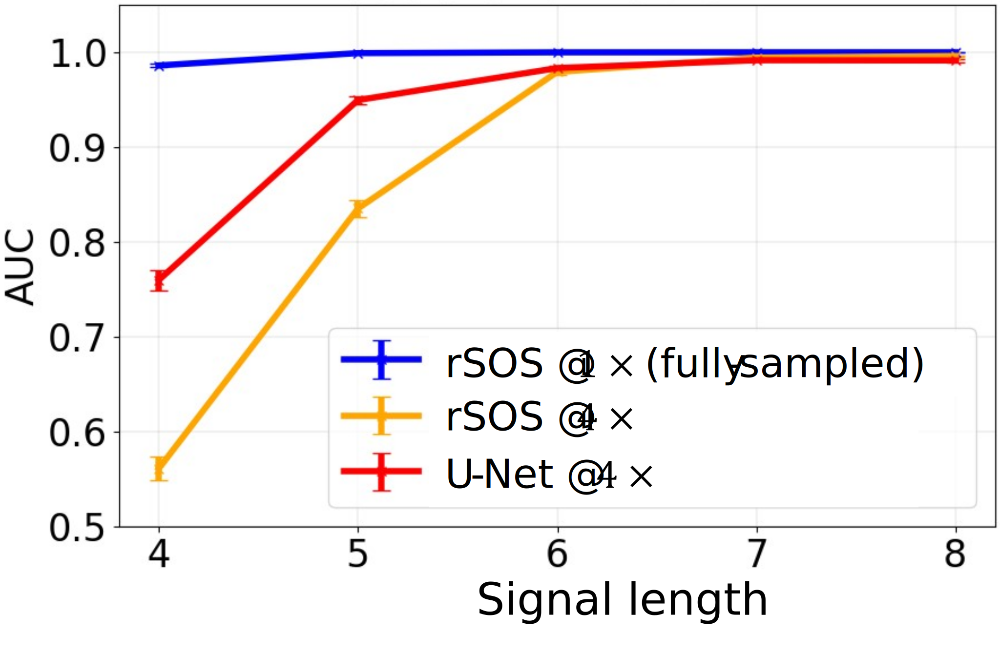

# A simple example of the DLMO framework

This demo uploads pretrained weights and DDPM-generated objects(SOMs) uploaded in this repository and walks through previous demos (demo2, demo3) to demostrate the application of DLMO observer model to get the descrimination-based output relative to different MR reconstruction methods (for a use case study of acceleration factor by 4). It contains four parts that should be run in order:

1. [*Synthetic defect insertion*](https://github.com/DIDSR/DLMO/tree/main/src/demo2)

   Insert the singlet and doublet signals corresponding to an acceleration factor of 4 and store the resulting MR images in an HDF5 file as follows:
   ```
   cd src/demo2
   python signal_insertion_test.py 4 0.7 '4,5,6,7,8'
   ```

2. [*MR acquisition and reconstruction*](https://github.com/DIDSR/DLMO/tree/main/src/demo3)

   Read the HDF5 file from Step 1 and perform rSOS-based conventional reconstruction at both the accelerated rate (serving as the baseline lower bound) and the fully sampled rate (serving as the reference upper bound).
   ```
   cd src/demo3
   python rsos_ddpm_test.py 4
   ```

3. [*AI reconstruction*](https://github.com/DIDSR/DLMO/tree/main/src/demo5/AI_rec)

   Run a AI-based reconstruction, such as the included U-Net pretrained weights, on the accelerated images from step 2.
   ```
   cd src/demo5/AI_rec
   python DL_denoiser_eval.py --task rayleigh --test-path ../../demo3/rsos_rec --acceleration 4 --model_name unet --num-channels 1 --batch-size 10 --pretrained-model-path trained_model
   ```

4. [*DLMO testing*](https://github.com/DIDSR/DLMO/tree/main/src/demo5/DLMO_test)

   Apply model observers to the three HDF5 files from Steps 1-3 for the three different reconstruction.
   
   #### DLMO on accelearated rSOS(4x) reconstruction 
   ```
   cd ../DLMO_test
   python dlmo_test_hvd.py --task rayleigh --test-path ../../demo3/rsos_rec --acceleration 4 \
   --batch-size 10 --pretrained-model-path trained_model/mri_cnn_dlmo_acc_4_hvd --pretrained-model-epoch 50
   ```

   #### DLMO on accelearated UNet(4x) reconstruction
   ``` 
   python dlmo_test_hvd.py --task rayleigh --test-path ../AI_rec/ai_rec --cnn-denoiser-name unet \
   --acceleration 4 --batch-size 10 --pretrained-model-path trained_model/mri_cnn_dlmo_acc_4_unet_hvd \
   --pretrained-model-epoch 50
   ```

   #### DLMO on fully sampled rSOS(1x) reconstruction 
   ```
   python dlmo_test_hvd.py --task rayleigh --test-path ../../demo3/rsos_rec --acceleration 1 \
   --batch-size 10 --pretrained-model-path trained_model/mri_cnn_dlmo_acc_1_hvd --pretrained-model-epoch 170
   ```

   #### Process the DLMO discrimination-based outputs from the above obtianed three methods and compute PC (AUC) by signal length (4-8 mm) to generate a summarized plot as shown in figure 4 in our DLMO paper:
   
   ```
   python step4_eval.py --dlmo-eval-on-ref './dlmo_discrimination/acc1/preds_rsos.npy' \
   --dlmo-eval-on-acc-rsos './dlmo_discrimination/acc4/preds_rsos.npy' \
   --dlmo-eval-on-acc-ai-rec './dlmo_discrimination/acc4/preds_unet.npy' \
   --l-list-file '../../demo3/rsos_rec/test_acc4_at_acc1_rsos.hdf5' \
   --recon-method-str 'rSOS_1x,rSOS_4x,U-Net_4x' \
   --signal-length-arr 4 5 6 7 8
   ```

   <p align="left">
	 
   </p>
