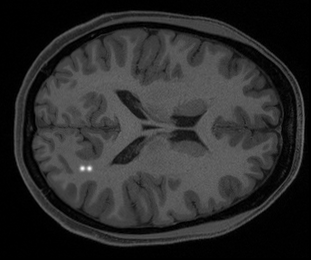
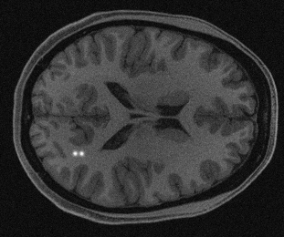

# Synthetic data acquisition

This script performs forward projection and reconstruction of DDPM (Denoising Diffusion Probabilistic Models) generated objects using RSOS (Root Sum of Squares) method to create a few examples of accelerated MR images. It saves the reconstructions in HDF5 format as well as png format.

Command-line Options:
```
Acceleration (int): Acceleration factor for sparse sampling (2, 4, 6, or 8).
Number of generated images (int): Number of images to generate.
Is PNG (bool): Whether to save PNG examples (1) or only HDF5 outputs (0).
```

Usage:
```
python synthetic_img_acquisition.py [acceleration factor] [num_gen_imgs] [is_png]
```

Example of running the script at acceleration factor 2:
```
python synthetic_img_acquisition.py 2 10 1
```

Note: Bundled example DDPM objects are provided in `examples/DDPM_obj/` so that this small workflow can be run without first executing demo 1.

Example of the outputs:




