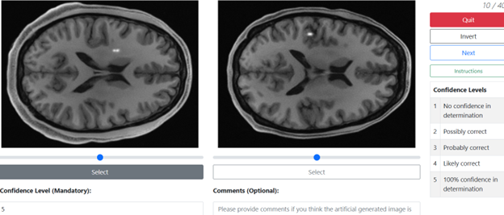

# Pivotal study

This script conducts a similarity test to investigate whether DLMO performs similarly to human readers within a pre-defined margin of 0.1 proportion correct (i.e., for the positively valued AUC difference, is the upper bound < 0.1?). To run the script, simply execute `similarity_test.R`. To use it for your own project, please update the `DLMO reading results` section in `similarity_test.R`, and provide reading scores in the `reading_scores` folder following the same format.

To run the analysis, execute:

```bash
Rscript similarity_test.R
```

# A representative example of using the above-mentioned script

## Study design

The pivotal human-observer validation study follows a 2AFC design. In each trial, the reader is shown one singlet image and one doublet image reconstructed under the same imaging condition. The reader's task is to select the image containing the doublet signal. The primary human-observer figure of merit is proportion correct (PC). Under the 2AFC framework, PC is interpreted as the AUC corresponding to a rating-based study on the same binary discrimination task.

In the study described in [our DLMO paper](https://arxiv.org/abs/2602.22535), the objective was to determine whether the human-label-trained DLMO was statistically similar to human readers on the Rayleigh discrimination task. The pre-specified similarity margin was 0.1 PC. The pivotal study used 640 singlet-doublet pairs and four trained non-physician readers in a split-plot design. Each reader evaluated 160 independent pairs for each reconstruction-method and acceleration-factor condition. The evaluated reconstruction methods were rSOS and U-Net, and the evaluated acceleration factors were 4x and 8x. Therefore, each reader completed four 2AFC studies:

- rSOS, 4x acceleration
- U-Net, 4x acceleration
- rSOS, 8x acceleration
- U-Net, 8x acceleration

For each condition, each image pair should contain a singlet and doublet image with the same signal intensity and signal length.

## Preparing 2AFC image pairs

For each acceleration factor, reconstruction method, signal intensity, and signal length:

1. Generate singlet and doublet image pairs. The two images in each pair (corresponding to a single 2AFC case) should have the same signal intensity, signal length, acceleration factor, and reconstruction method. They should differ only in signal type. In our 2AFC experiment, the image pairs also differed in their backgrounds, as shown in the image below.
2. Randomize the left/right or first/second display order for singlet and doublet images.
3. Record the correct answer for each pair, i.e., which displayed image contains the doublet signal.
4. Assign each pair to a single reader when using a split-plot design. In [our DLMO paper](https://arxiv.org/abs/2602.22535), cases were non-overlapping across the four readers.
5. Blind the reader to the correct answer, reconstruction method, and any information that could reveal whether an image contains a singlet or doublet signal.

<p align="center">
      
      <br> An example 2AFC trial in which an image pair is displayed to a reader. One image contains a singlet signal and the other contains a doublet signal. The reader is asked to select the image containing the doublet signal. The reader may also provide a confidence score if the reader-study interface supports it
</p>

The study may be implemented using any 2AFC reader-study interface. In [our DLMO paper](https://arxiv.org/abs/2602.22535), we used a [web-based 2AFC application](https://rad-apps.mir.wustl.edu/twoafc). The present repository only stores the resulting reader scores and performs the iMRMC-based similarity analysis; it does not provide the reader-study web interface.

## Reader-score file format

Human-reader results should be saved under:

```text
reading_scores/<reconstruction_method>/R<reader_number>_acc<acceleration_factor>_L<signal_length>.csv
```

For example:

```text
reading_scores/rsos/R1_acc4_L5.csv
reading_scores/unet/R4_acc8_L8.csv
```

Each CSV file should contain the following columns:

| Column | Description |
| --- | --- |
| `User` | Reader identifier, e.g., `R1`, `R2`, `R3`, or `R4`. |
| `ImageID` | Case identifier within that signal-length subset. In the current script, these IDs are offset internally by signal length so that cases with different lengths have unique IDs. |
| `Correctness` | Binary 2AFC result. Use `1` if the reader selected the doublet image and `0` otherwise. |
| `Confidence` | Optional reader confidence score. This column is retained for documentation but is not used by `similarity_test.R`. |
| `Comments` | Optional comments from the reader. This column is not used by `similarity_test.R`. |

An example row is:

```csv
User,ImageID,Correctness,Confidence,Comments
R1,3,1,4,
```

## Running the similarity analysis

Before running `similarity_test.R`, choose the acceleration factor and reconstruction method near the top of the script:

```r
acc <- '8'
rec_method <- 'unet'
```

Valid values in the provided example data are:

- `acc`: `'4'` or `'8'`
- `rec_method`: `'rsos'` or `'unet'`

The script then:

1. Reads the corresponding human-reader CSV files from `reading_scores/<rec_method>/`.
2. Combines the files across signal lengths 5-8 mm.
3. Curates the reader data using `createIMRMC2AFCdf()`.
4. Estimates human-observer PC/AUC and variance using `doIMRMC()`.
5. Loads the corresponding DLMO AUC and variance from the `DLMO reading results` block.
6. Computes the DLMO-human difference and its confidence interval.

When adapting this script to a new reconstruction method, the DLMO should be appropriately retrained or retuned for that method. The AUC and variance values should be replaced with estimates derived from the DLMO test statistic outputs corresponding to the new reconstruction method and the acceleration factor under evaluation. Similarly, the 2AFC human reader–based AUC and variance values should likewise correspond to the new reconstruction method and the same acceleration factor

## Final comments on adapting the 2AFC study and DLMO testing

1. Randomize display order to avoid positional bias.
2. Use independent case assignments when implementing a split-plot design.
3. If multiple reconstruction methods or acceleration factors are tested, account for multiplicity when interpreting the similarity tests. [Our DLMO paper](https://arxiv.org/abs/2602.22535) used Bonferroni correction across the four reconstruction-method and acceleration-factor conditions.
4. For a new study, perform a pilot reader study and sample-size calculation before the pivotal validation study.